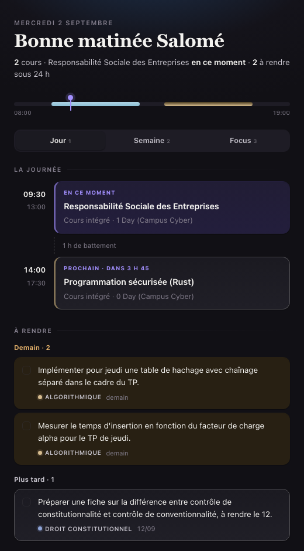
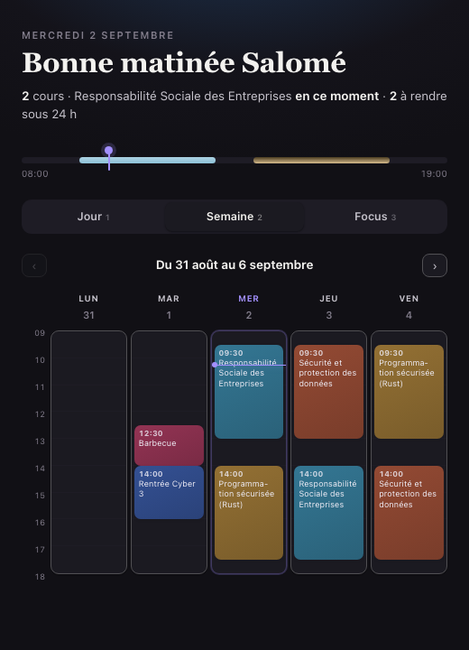

<h1 align="center">Brief Matin</h1>

<p align="center">
  Chaque matin à 9 h, une petite fenêtre s'ouvre et vous dit<br>
  ce que vous avez aujourd'hui, et ce que vous devez rendre.
</p>

<p align="center">
  
</p>

<br>

## L'idée

Le matin, on veut savoir trois choses : **quels cours**, **dans quelle salle**,
et **qu'est-ce qui est à rendre**. Ces trois choses vivent à trois endroits
différents — l'emploi du temps de l'école, les notes de cours, un coin de tête.

Brief Matin les réunit dans une fenêtre qui s'ouvre toute seule, et se referme
quand on a fini de la lire.

- **L'emploi du temps** vient directement de Zeus, l'intranet des écoles IONIS.
- **Les devoirs** sont lus dans les notes de cours d'Obsidian — toutes les cases
  à cocher du carnet, rassemblées et triées par urgence.
- **Rien à saisir deux fois.** Ce qui est écrit dans une note apparaît le
  lendemain matin dans la fenêtre.

<br>

## Trois façons de regarder sa journée

### Le jour

Les cours placés sur une frise horaire, le cours en cours mis en avant, celui
qui suit avec son compte à rebours, et les trous entre deux annoncés. En
dessous, les devoirs groupés par urgence : en retard, aujourd'hui, demain,
cette semaine.

**Les cases à cocher sont vraies** : un clic barre le devoir, et il est coché
dans la note Obsidian d'où il vient. C'est la vue montrée en haut de cette page.

### La semaine

L'emploi du temps en grille, une couleur par matière, la colonne du jour
soulignée et une ligne qui suit l'heure. Les flèches parcourent **sept
semaines** : celle qui vient de passer, celle en cours, et les cinq suivantes.

<p align="center">
  
</p>

### Le focus

Une seule chose, en grand, et rien d'autre. Le cours en cours s'il y en a un,
sinon le devoir le plus en retard, sinon celui qui commence bientôt. « C'est
fait » le coche, « Autre chose » passe au suivant.

Pour les matins où la liste complète est plus décourageante qu'utile.

<p align="center">
  
</p>

<br>

## Ce qui se passe sans qu'on y pense

**La fenêtre s'ouvre à 9 h**, tous les jours. On la ferme, elle revient demain.

**Un nouveau devoir se signale.** Quand un devoir apparaît dans les notes — parce
qu'un cours vient d'être transcrit, ou parce qu'on vient de l'écrire —  une
notification l'annonce, avec la matière et la date de rendu.

> **Nouveau devoir** · Droit constitutionnel
> Préparer une fiche sur le contrôle de conventionnalité — à rendre le 12/09

**L'accès à l'emploi du temps se renouvelle en un clic.** Une pastille en bas de
la fenêtre indique s'il est encore valide. Un clic dessus ouvre la connexion,
on s'identifie, et c'est reparti.

<br>

## Installer

Il faut Obsidian, un compte dans une école IONIS, et un Mac — Apple Silicon
ou Intel, macOS 12 ou plus récent.

Sur un autre système, `brief-matin fenetre` ouvre le brief dans une fenêtre de
navigateur avec les mêmes possibilités ; voir les [notes techniques](TECHNIQUE.md).

```bash
git clone https://github.com/messyhat555/brief-matin.git
cd brief-matin
./install.sh
```

L'installation trouve le carnet Obsidian toute seule, construit l'application
dans le dossier Applications, et programme l'ouverture du matin. Elle se termine
par un état des lieux de ce qui marche et de ce qui manque.

À la première ouverture, la fenêtre demande simplement comment vous appeler —
on peut passer. Un clic sur la salutation permet d'en changer plus tard.

Ensuite, un clic sur **Se connecter à Zeus**, et il ne reste plus qu'à choisir
sa classe.

<br>

## Ajouter un devoir soi-même

Tout n'arrive pas par les notes de cours. En bas de la liste des devoirs,
**« + Ajouter un devoir »** ouvre trois champs : ce qu'il y a à faire, la
matière — les matières déjà connues sont proposées — et la date de rendu.

Le devoir n'est pas stocké dans un coin de l'application : il est écrit dans une
note du carnet Obsidian, comme les autres. Il se coche de la même façon, se
retrouve dans une recherche, et suit le carnet partout.

## D'où viennent les devoirs

De n'importe quelle case à cocher du carnet Obsidian, sous un titre du genre
« À faire » ou « Devoirs ». Écrites à la main, ou produites automatiquement par
[flow2obsidian](https://github.com/messyhat555/flow2obsidian), qui transforme un
cours enregistré en fiche de révision.

Les dates sont comprises telles qu'on les écrit :

| Dans la note | Compris comme |
| --- | --- |
| `à rendre le 12` | le 12 de ce mois, ou du suivant s'il est passé |
| `pour le TP de jeudi` | le prochain jeudi |
| `pour la semaine prochaine` | lundi qui vient |

Quand rien n'est sûr, le devoir s'affiche sans date plutôt qu'avec une date
inventée.

<br>

## Bon à savoir

L'application ne parle qu'à deux interlocuteurs : le carnet Obsidian, sur le
disque, et l'intranet Zeus de l'école. Rien d'autre ne sort de la machine.

L'accès à Zeus est rangé dans le trousseau de macOS, et ne donne accès qu'aux
emplois du temps. Tout s'efface d'une commande :

```bash
brief-matin zeus-deconnexion
```

Le détail — installation avancée, réglages, choix de sécurité, fonctionnement
interne — est dans les [notes techniques](TECHNIQUE.md).

<br>

<p align="center"><sub>MIT · fait pour un usage personnel, partagé au cas où</sub></p>
